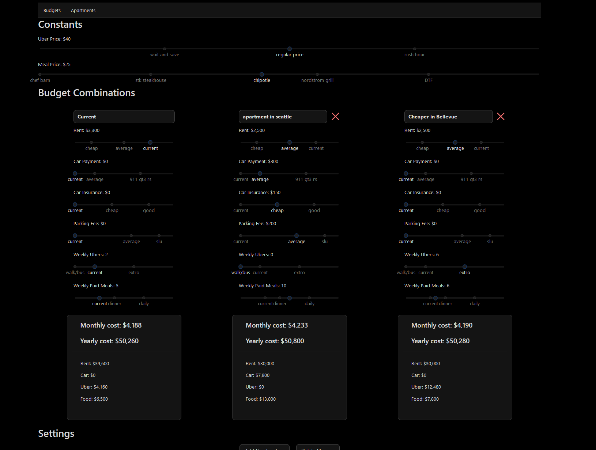

# I'm getting laid off
and I need a new apartment.



### Install

Install dependencies.

```bash
bun install
```

Serve with hot reload at <http://localhost:5173>.

```bash
bun dev
```

### Lint

```bash
bun lint
```

### Typecheck

```bash
bun typecheck
```

### Build

```bash
bun build
```

### Test

```bash
bun test
```

View and interact with your tests via UI.

```bash
bun test:ui
```

## License

This project is licensed under the MIT License.
